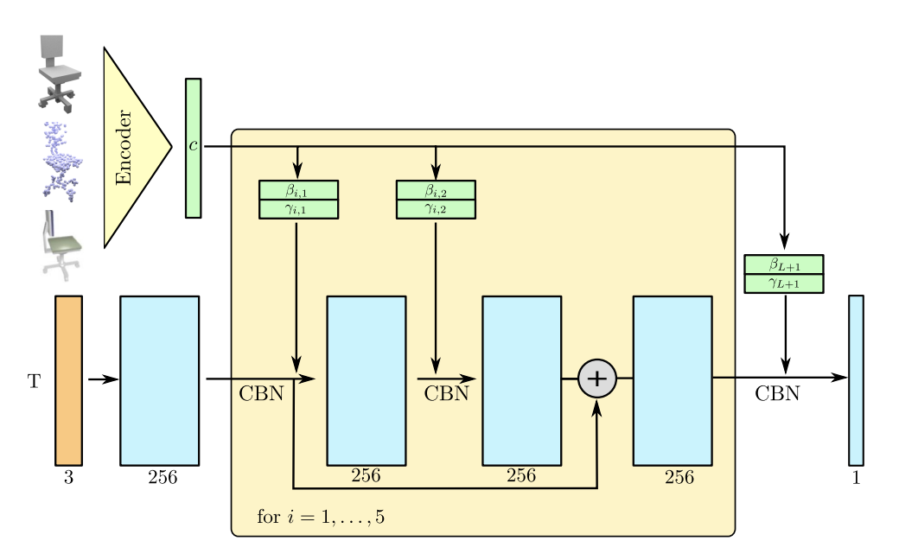
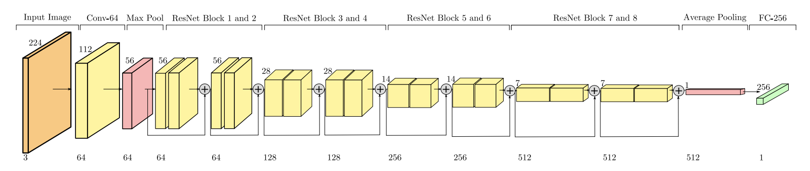
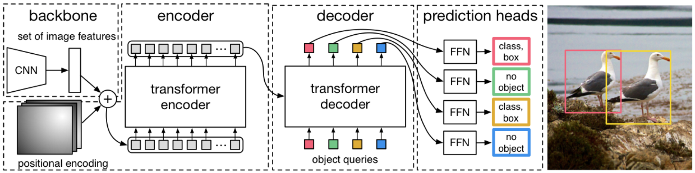
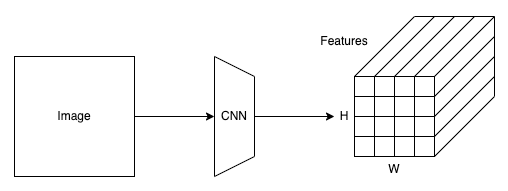
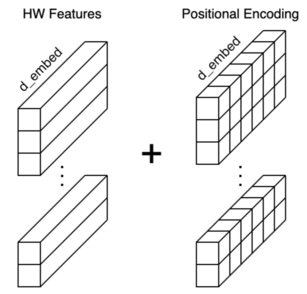
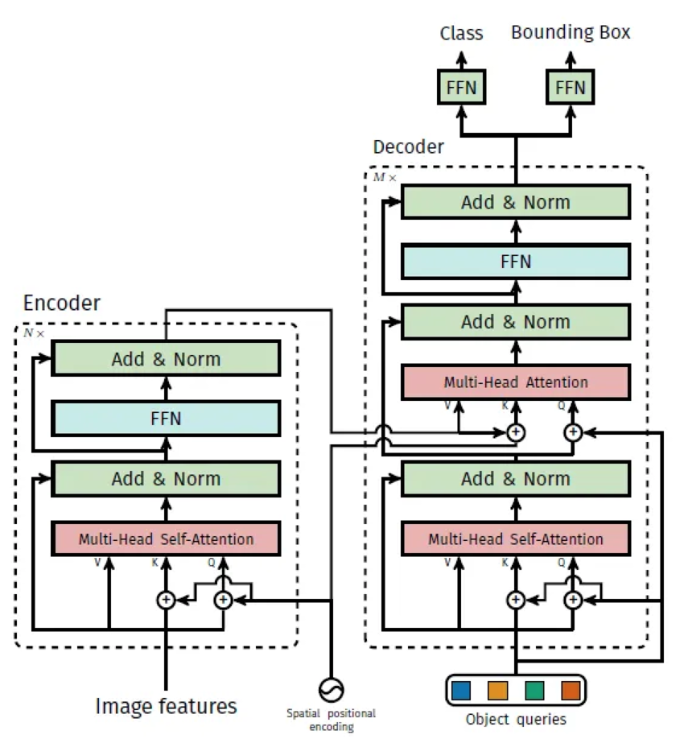
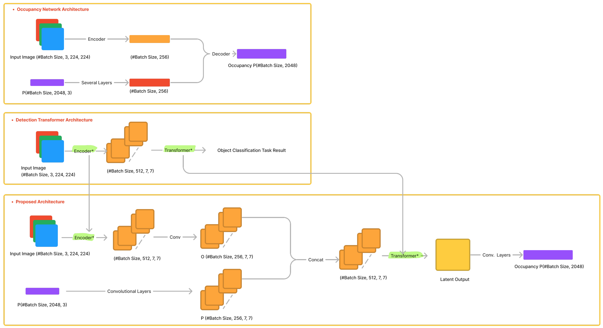

# **Occupancy Networks with Transformers**
The project aims to improve the performance of the Occupancy Network by incorporating the DETR Transformer architecture into the model.
## **1. Occupancy Networks: Learning 3D Reconstruction in Function Space** 

### **Approach**

Instead of reconstructing a 3D shape in the form of a (discrete) voxel grid, point cloud, or mesh from the input data, occupancy networks return a function that predicts an occupancy probability for a continuous 3D point.

The trick is the following: a function that takes an observation x as input and returns a function mapping a 3D point p to the occupancy probability can be replaced by a function that takes a pair (p, x) and returns the occupancy probability.

Limitations of existing 3D data representations
- Voxel grids: memory-heavy, up to 1283–2563 maximum resolution
- Point clouds: need post-processing to generate a (mesh) surface
- Meshes: existing approaches often require additional regularization, can generate only meshes with simple topology, need the same class reference template, or cannot guarantee closed surfaces

### **Pipeline**
- **Training:** the network fθ(p, x) takes as input the task specific object (for example, for single image 3D reconstruction this would be an RGB image) and a batch of 3D points, randomly sampled from the ground truth 3D representation. For each 3D point, the network predicts the occupancy probability which is then compared with the ground truth to compute the mini-batch loss.
  
- **Inference**: to extract a 3D mesh from the learned fθ(p, x), the paper uses a Multiresolution IsoSurface Extraction (MISE) algorithm, which as a first step is building an octree by progressively sampling in the points where neighbors occupancy predictions do not match. After that, the Marching Cubes algorithm is applied to extract the mesh surface.

### **Network Architecture**
- The network architecture is generally the same across different tasks (e.g. single image 3D reconstruction or point cloud completion) with the task-specific encoder being the only changing element.

- Once the task encoder has produced the embedding c, it is passed as input along with the batch of T sampled 3D points, which are processed by 5 sequential ResNet blocks. To condition the network output on the input embedding c, Conditional Batch Normalization is used.

- For single image 3D reconstruction the network uses a ResNet-18 encoder with altered last layer to produce 256-dim embeddings.

## **2. DETR: End-to-End Object Detection with Transformers** 
### **Approach**
Detr, or Detection Transformer, is a set-based object detector using a Transformer on top of a convolutional backbone. It uses a conventional CNN backbone to learn a 2D representation of an input image.

### **Network Architecture**

DETR has three major components:
  - A Convolutional Neural Network (CNN) Backbone
  - A Transformer’s Encoder-Decoder
  - Feed-forward Networks (FFN)

- DETR uses a conventional CNN backbone to learn a 2D representation of an input image. The backbone is ImageNet-pretrained ResNet-50 with frozen batch norm.

- DETR flattens the H x W feature map to HW feature vectors and adds positional encodings to each feature vector. Since the Transformer’s encoder is permutation invariant and does not have a built-in structure to handle positional information, we must enrich each feature vector with the positional encoding.
- Then, it passes the input embeddings to the Transformer’s encoder-decoder, which generates output embeddings.

### **2D Positional Encoding**
- DETR uses a fixed positional encoding similar to the one used in the original Transformer
- However, the original Transformer handles word sequences where the word positions are one-dimensional. On the contrary, DETR handles a grid of feature vectors where the grid cell positions are two-dimensional.
- DETR encodes row and column positions separately in the half-size (d_embed / 2). Then, it creates permutations of row and column position encodings. A pair of a row position and a column position is a concatenation of the row positional encoding and the column positional encoding.

### **Transformers**

- The Transformer’s encoder enriches embeddings through the multi-head self-attention layers. One notable difference from the original encoder is that DETR adds the positional encodings to the input of each multi-head attention layer.
- Moreover, the decoder also has a notable difference from the original Transformer. The input embeddings to the decoder are called object queries.  The decoder receives the object queries as inputs and the embeddings from the encoder as contexts to produce output embeddings for the final stage. 
- Output embedding of the decoder is passed to a feed forward network (FFN) that predicts either a detection (class and bounding box) or a “no object” class.

## **3. Proposed Architecture** 

The proposed network for 3D reconstruction from a single image consists of:
   -   ResNet Backbone for feature extraction
   -   Transformer encoder that takes as input the features supplemented with positional encodings
   -   Transformer decoder that takes as input the object queries, output embedding of the encoder, and the 3D locations of the points
   -   Feed-forward Network (FFN) that predicts an occupancy probability for a continuous 3D point